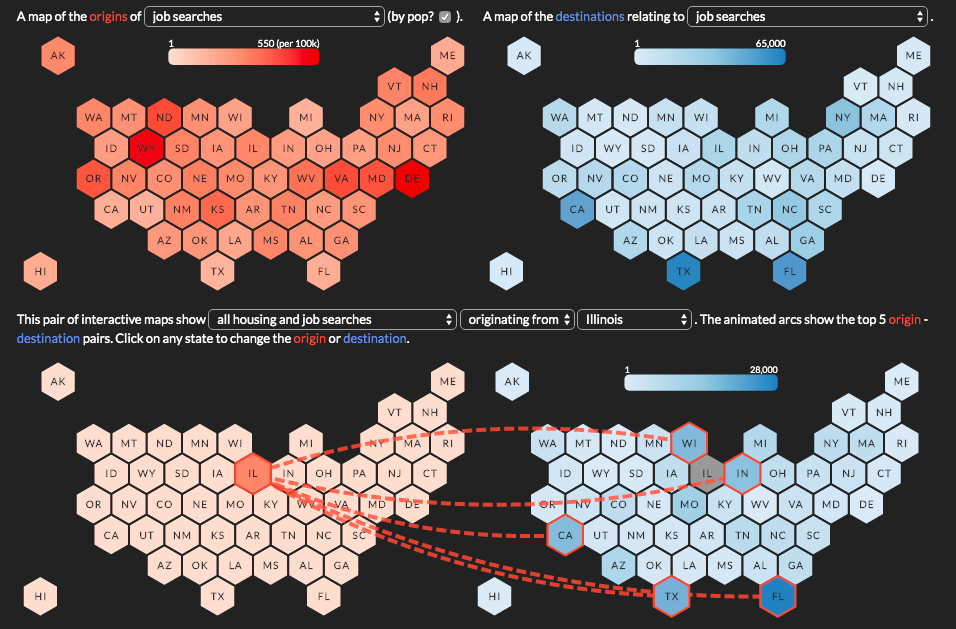

## Interactive Science: Forecasting Domestic Migration

An interactive visualization companion to the 2019 Web Conference (WWW) paper *[Forecasting U.S. Domestic Migration Using Internet Search Queries](https://www.microsoft.com/en-us/research/publication/forecasting-u-s-domestic-migration-using-internet-search-queries/)* by [Allen Yilun Lin](http://users.eecs.northwestern.edu/~ylo3469/) (Northwestern University), [Justin Cranshaw](https://www.microsoft.com/en-us/research/people/justincr/) (Microsoft Research), and [Scott Counts](https://www.microsoft.com/en-us/research/people/counts/) (Microsoft Research).

The interactive maps present 4.2 Million migration queries for housing and jobs between US States, a sample from the 121 Million migration queries used in [the analysis presented in the paper](https://www.microsoft.com/en-us/research/publication/forecasting-u-s-domestic-migration-using-internet-search-queries/). Numbers are rounded and content is very slightly altered for privacy reasons.

This repository is maintained by [Matthew Brehmer](https://github.com/mattbrehmer).

### Setup / Testing

1. Open a terminal and navigate to this directory

2. Start a python server with: `python3 -m http.server 8080`

5. Open [localhost:8080](http://localhost:8080/) in Chrome.

### 3rd party package dependencies

- [d3](https://www.npmjs.com/package/d3) BSD-3 license
- [topojson](https://www.npmjs.com/package/topojson) BSD-3 license
- [lodash](https://www.npmjs.com/package/lodash) MIT license

### Acknowledgments 

The tilegram SVG of the United States used in this project was created using [Pitch Interactive](http://pitchinteractive.com/)'s [Tilegrams](https://pitchinteractiveinc.github.io/tilegrams/) generator.